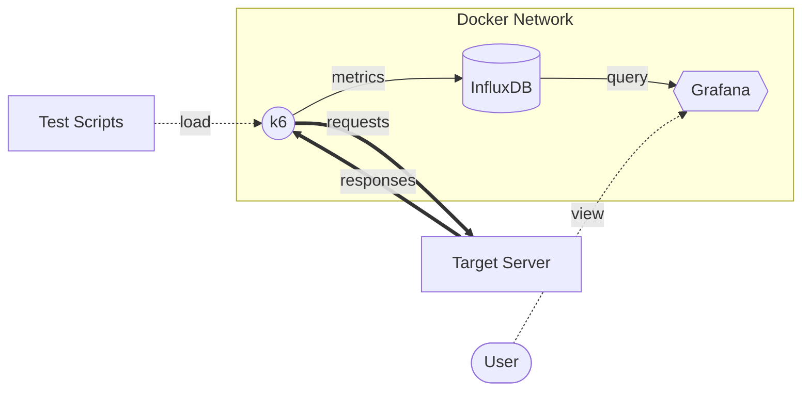
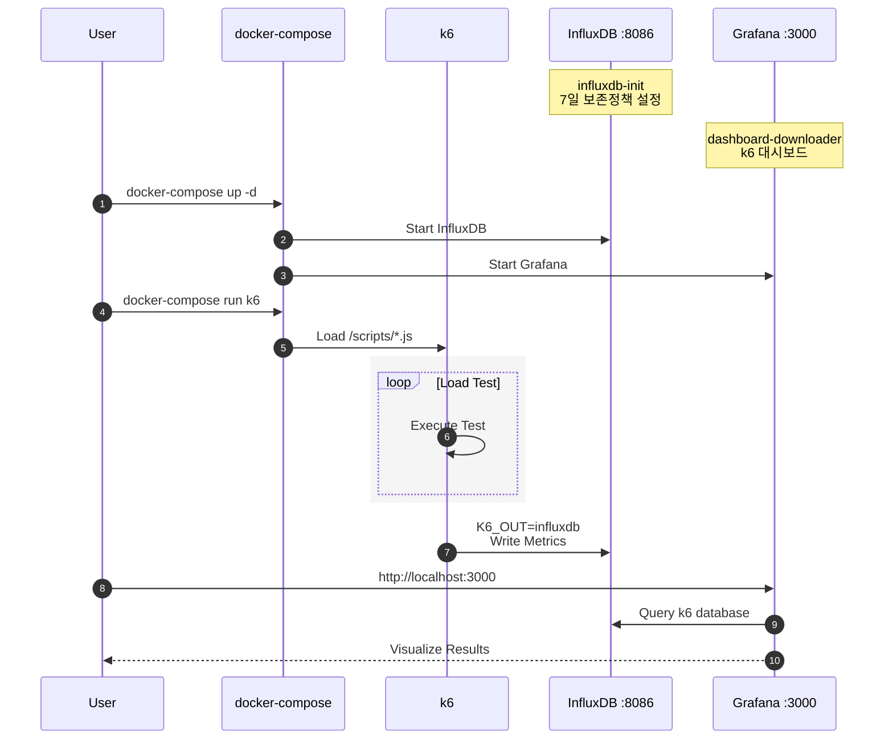
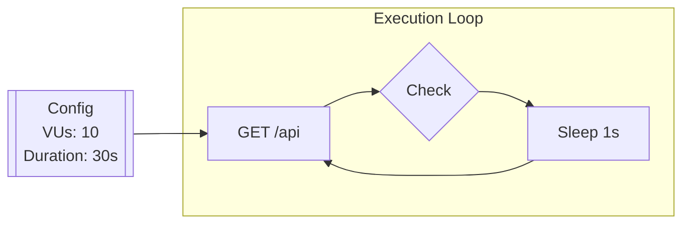
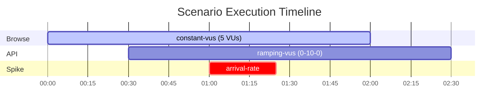
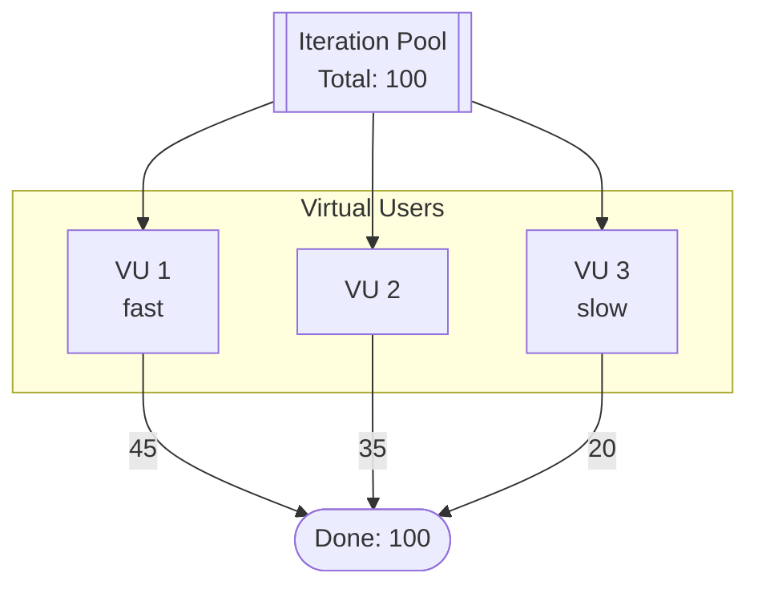
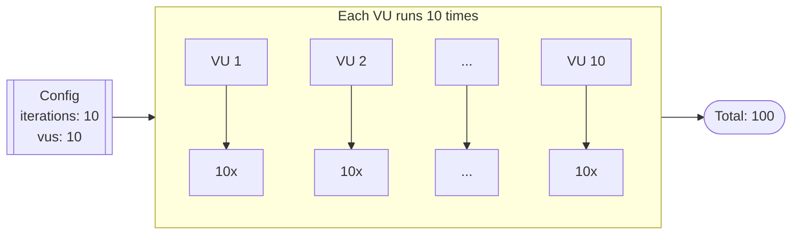
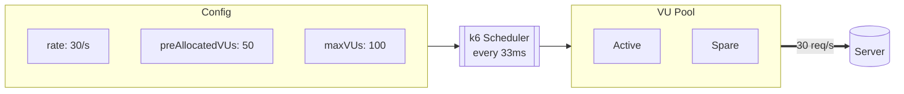
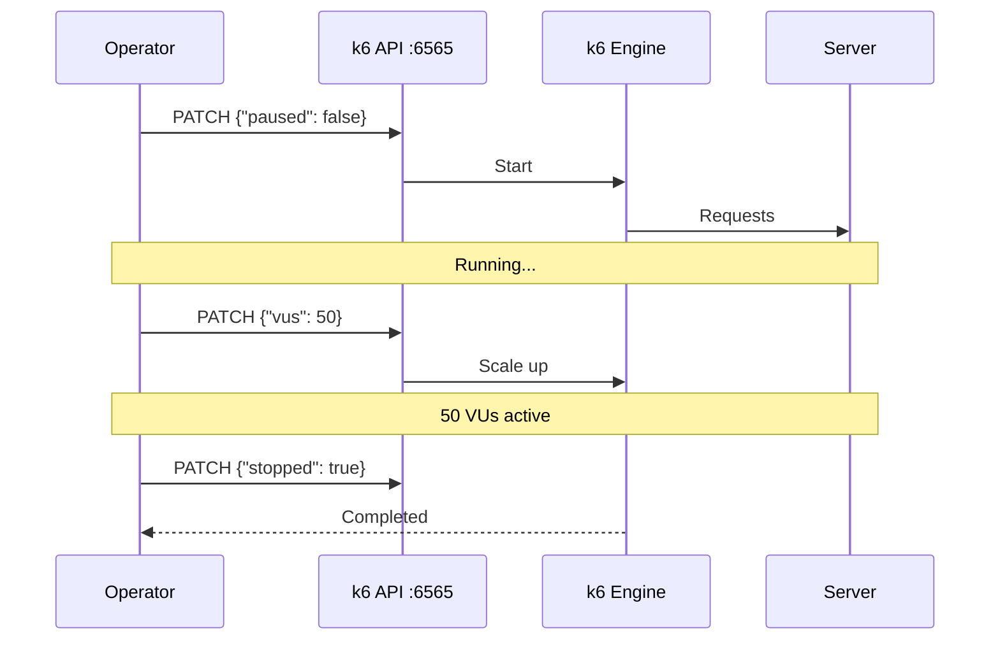
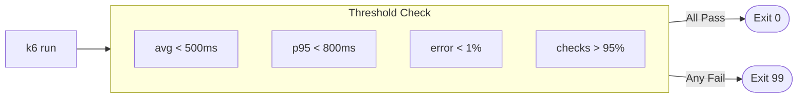
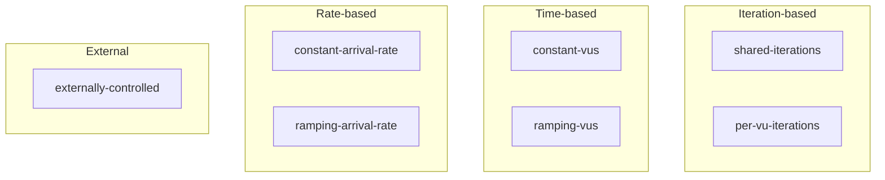

# k6 Performance Testing Stack

k6 부하 테스트를 위한 Docker 기반 모니터링 스택입니다.

---

## Architecture Overview



**구성 요소:**

| Component | Version | Port | Description |
|:----------|:--------|:----:|:------------|
| k6 | v0.49.0 | - | Load Testing |
| InfluxDB | v1.8 | 8086 | Time-Series Database |
| Grafana | v10.4.3 | 3000 | Visualization |

---

## Stack Flow



---

## Project Structure

```
k6-stack/
├── docker-compose.yml        # Docker 서비스 정의
├── grafana/
│   ├── dashboards/
│   │   └── k6.json           # k6 대시보드 (자동 다운로드)
│   └── provisioning/
│       ├── dashboards/
│       │   └── dashboards.yml
│       └── datasources/
│           └── datasource.yml
├── influxdb/
│   └── init/
│       └── init.influxql     # 7일 보존 정책 설정
└── scripts/                  # k6 테스트 스크립트
    ├── 01-basic.js
    ├── 02-stages.js
    ├── 03-scenarios.js
    ├── 04-shared-iterations.js
    ├── 05-per-vu-iterations.js
    ├── 06-constant-vus.js
    ├── 07-ramping-vus.js
    ├── 08-constant-arrival-rate.js
    ├── 09-externally-controlled.js
    └── 10-thresholds.js
```

---

## Services

| Service | Image | Port | Description |
|:--------|:------|:----:|:------------|
| influxdb | `influxdb:1.8` | 8086 | 시계열 데이터베이스 |
| grafana | `grafana/grafana:10.4.3` | 3000 | 시각화 대시보드 |
| k6 | `grafana/k6:0.49.0` | - | 부하 테스트 도구 |
| influxdb-init | `curlimages/curl:8.5.0` | - | InfluxDB 초기화 |
| dashboard-downloader | `curlimages/curl:8.5.0` | - | 대시보드 다운로드 |

---

## Quick Start

### 1. 스택 실행

```bash
docker-compose up -d influxdb grafana
```

### 2. k6 테스트 실행

```bash
docker-compose run --rm k6 run /scripts/01-basic.js
```

### 3. 결과 확인

- **Grafana**: http://localhost:3000
- **로그인**: `admin` / `admin`

---

## Test Scripts

### 스크립트 목록

| 파일 | 유형 | 설명 |
|:-----|:-----|:-----|
| `01-basic.js` | 기본 | 가장 단순한 형태의 테스트 |
| `02-stages.js` | 단계별 부하 | VU를 단계적으로 증가/감소 |
| `03-scenarios.js` | 시나리오 | 여러 시나리오 동시 실행 |
| `04-shared-iterations.js` | Executor | 총 반복 횟수를 VU가 공유 |
| `05-per-vu-iterations.js` | Executor | 각 VU가 고정 횟수 반복 |
| `06-constant-vus.js` | Executor | 일정한 VU 수 유지 |
| `07-ramping-vus.js` | Executor | 시간에 따라 VU 조절 |
| `08-constant-arrival-rate.js` | Executor | 일정한 RPS 유지 |
| `09-externally-controlled.js` | Executor | 외부에서 동적 제어 |
| `10-thresholds.js` | 성능 임계값 | Pass/Fail 기준 설정 |

---

### 1. Basic Test (`01-basic.js`)

가장 기본적인 부하 테스트입니다.



```bash
docker-compose run --rm k6 run /scripts/01-basic.js
```

---

### 2. Stages Test (`02-stages.js`)

시간에 따라 VU 수를 단계적으로 조절합니다.

```
      VUs
       ^
    50 |                    +-----------+
       |                   /             \
       |                  /               \
    10 |    +------------+                 \
       |   /                                \
     0 +---+----+----+----+----+----+----+---+--> Time
       0   1m   2m   3m   4m   5m   6m   7m   8m

       [Ramp] [  Steady  ] [Ramp] [ Peak  ] [Down]
```

```bash
docker-compose run --rm k6 run /scripts/02-stages.js
```

---

### 3. Scenarios Test (`03-scenarios.js`)

여러 시나리오를 동시에 실행합니다.



```bash
docker-compose run --rm k6 run /scripts/03-scenarios.js
```

---

### 4. Shared Iterations (`04-shared-iterations.js`)

**총 반복 횟수를 모든 VU가 공유**합니다.



- 빠른 VU가 더 많은 반복을 처리
- **정확한 총 요청 수**가 필요할 때 사용

```bash
docker-compose run --rm k6 run /scripts/04-shared-iterations.js
```

---

### 5. Per-VU Iterations (`05-per-vu-iterations.js`)

**각 VU가 정해진 횟수만큼 독립적으로 반복**합니다.



- 모든 VU가 **동일한 횟수** 실행 보장
- VU별 일관된 테스트가 필요할 때 사용

```bash
docker-compose run --rm k6 run /scripts/05-per-vu-iterations.js
```

---

### 6. Constant VUs (`06-constant-vus.js`)

**일정한 VU 수를 유지**합니다.

```
      VUs
       ^
    20 |  +=========================================+
       |  |                                         |
       |  |           Constant 20 VUs               |
       |  |                                         |
     0 +--+----+----+----+----+----+----+----+----+--> Time
          0   20s  40s  1m  1:20 1:40  2m  2:20  3m
```

```bash
docker-compose run --rm k6 run /scripts/06-constant-vus.js
```

---

### 7. Ramping VUs (`07-ramping-vus.js`)

**시간에 따라 VU 수를 동적으로 조절**합니다.

```
      VUs
       ^
    50 |                          *
       |                         / \
    40 |                        /   \
       |                       /     \
    20 |         *------------*       *------*
       |        /                             \
     5 |  *----*                               \
       |                                        *
     0 +--+----+----+----+----+----+----+----+--+--> Time
          |    |         |    |         |    |
        Warm Plateau   Ramp Peak    Spike  Cool
         up              up  Load   Test   down
```

```bash
docker-compose run --rm k6 run /scripts/07-ramping-vus.js
```

---

### 8. Constant Arrival Rate (`08-constant-arrival-rate.js`)

**일정한 RPS(초당 요청 수)를 유지**합니다.



- 응답 시간과 **관계없이** 고정된 요청률 유지
- 서버의 **처리량(throughput)** 테스트에 적합

```bash
docker-compose run --rm k6 run /scripts/08-constant-arrival-rate.js
```

---

### 9. Externally Controlled (`09-externally-controlled.js`)

**외부에서 REST API로 테스트를 제어**합니다.



**실행 방법:**

```bash
# 1. 테스트 시작 (일시정지 상태)
docker-compose run --rm -p 6565:6565 k6 run \
  --paused --address 0.0.0.0:6565 /scripts/09-externally-controlled.js

# 2. 테스트 시작
curl -X PATCH http://localhost:6565/v1/status \
  -H 'Content-Type: application/json' \
  -d '{"paused": false}'

# 3. VU 수 조절
curl -X PATCH http://localhost:6565/v1/status \
  -H 'Content-Type: application/json' \
  -d '{"vus": 50}'

# 4. 테스트 중지
curl -X PATCH http://localhost:6565/v1/status \
  -H 'Content-Type: application/json' \
  -d '{"stopped": true}'
```

---

### 10. Thresholds (`10-thresholds.js`)

**성능 임계값을 설정하여 Pass/Fail을 판단**합니다.



**주요 임계값:**

| 메트릭 | 조건 | 설명 |
|:-------|:-----|:-----|
| `http_req_duration` | `avg<500` | 평균 응답시간 < 500ms |
| `http_req_duration` | `p(95)<800` | 95% 응답시간 < 800ms |
| `http_req_duration` | `p(99)<1500` | 99% 응답시간 < 1500ms |
| `http_req_failed` | `rate<0.01` | 실패율 < 1% |
| `checks` | `rate>0.95` | Check 성공률 > 95% |

**CI/CD 연동:**

```bash
# 임계값 실패 시 non-zero exit code 반환
docker-compose run --rm k6 run /scripts/10-thresholds.js
echo "Exit code: $?"  # 0=pass, 99=threshold fail
```

---

## Executor 비교



| Executor | 제어 대상 | 사용 사례 |
|:---------|:----------|:----------|
| `shared-iterations` | 총 반복 횟수 | 정확한 요청 수 필요 |
| `per-vu-iterations` | VU별 반복 횟수 | VU별 일관성 필요 |
| `constant-vus` | VU 수 | 안정적 부하 테스트 |
| `ramping-vus` | VU 수 (시간별) | 점진적 부하 테스트 |
| `constant-arrival-rate` | RPS | 처리량 테스트 |
| `externally-controlled` | 외부 제어 | 수동/자동화 제어 |

---

## Configuration

### InfluxDB
- **Database**: `k6`
- **Retention Policy**: `7 days`
- **Authentication**: Disabled

### Grafana
- **Admin User**: `admin`
- **Admin Password**: `admin`
- **Dashboard**: [k6 Load Testing Results (ID: 14801)](https://grafana.com/grafana/dashboards/14801)

---

## Useful Commands

```bash
# 전체 스택 시작
docker-compose up -d

# 특정 스크립트 실행
docker-compose run --rm k6 run /scripts/01-basic.js

# VU, duration 지정
docker-compose run --rm k6 run --vus 50 --duration 1m /scripts/01-basic.js

# 로그 확인
docker-compose logs -f k6

# 스택 중지
docker-compose down

# 데이터 포함 완전 삭제
docker-compose down -v
```

---

## License

MIT


## 제3자 오픈소스 소프트웨어 고지

본 프로젝트는 아래 오픈소스 소프트웨어를 기반으로 구성되어 있습니다.
- k6 (https://k6.io/) – Grafana Labs에서 제공하는 부하 테스트 도구
- Grafana (https://grafana.com/) – Grafana Labs에서 제공하는 데이터 시각화 플랫폼
- InfluxDB (https://www.influxdata.com/) – 시계열 데이터베이스

각 소프트웨어의 상표 및 저작권은 해당 소유자에게 귀속됩니다.  
본 저장소는 제3자 소프트웨어의 바이너리, 실행 파일 또는 소스 코드를 포함하거나 재배포하지 않습니다.
